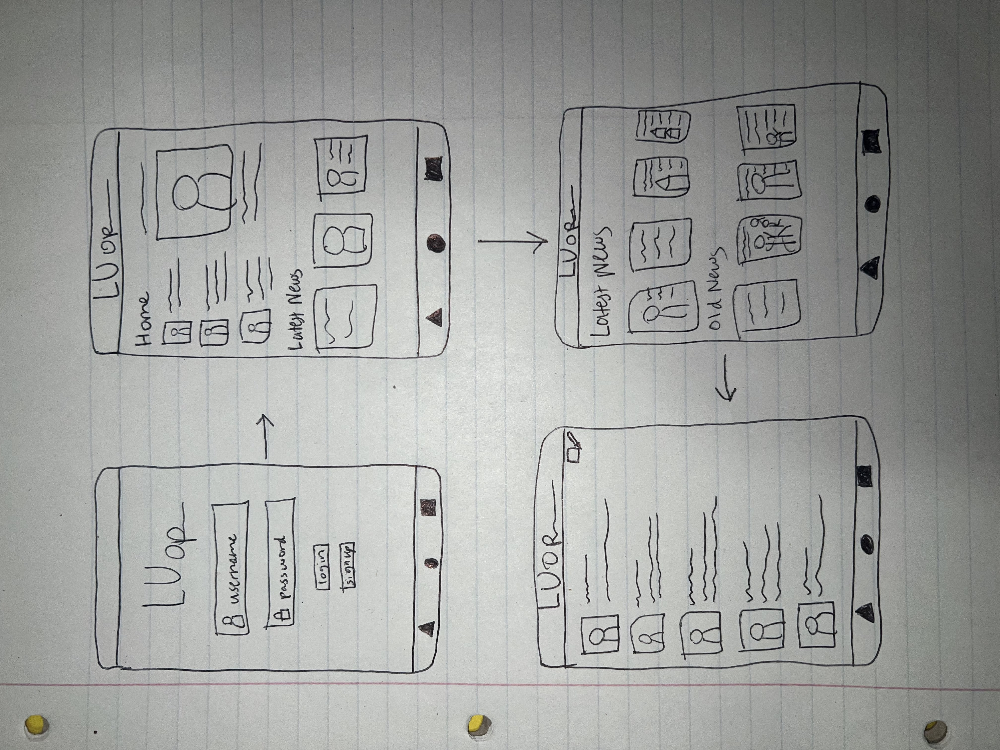

# Milestone 1 - LUop

## Table of Contents

1. [Overview](#Overview)
1. [Product Spec](#Product-Spec)
1. [Wireframes](#Wireframes)

## Overview

### Description

LUop is a social media app that will allow students who attend Langston University to connect and stay up to date on the latest LU news.
### App Evaluation

- **Category: Social media**
- **Mobile: Camera and audio**
- **Story: Langston University student will be able to connect with other students and stay up to date on latest LU news**
- **Market: Service over 3,000 students**
- **Habit: Low addiction**
- **Scope: Clearly defined and buildable**

## Product Spec

### 1. User Features (Required and Optional)

**Required Features**
- [x] Login/SignUp
- [] Messaging between students
- [] LU news updates

**Stretch Features**

* Marketplace for students to promote business

### 2. Screen Archetypes

- Login/signup
  - A school id is required to signup and signin
- Home page
  - Has the latest LU news
  - Tabs for other sections on the app
- News page
  - all LU news, both old and new
- Message interface
  - Standard message system ui, similar to groupme

### 3. Navigation

**Tab Navigation** (Tab to Screen)

* Home
* News
* Message

**Flow Navigation** (Screen to Screen)

- Home page
  - home
- News page
  - news
- Message interface
  - message

## Wireframes

### [BONUS] Digital Wireframes & Mockups

### [BONUS] Interactive Prototype
